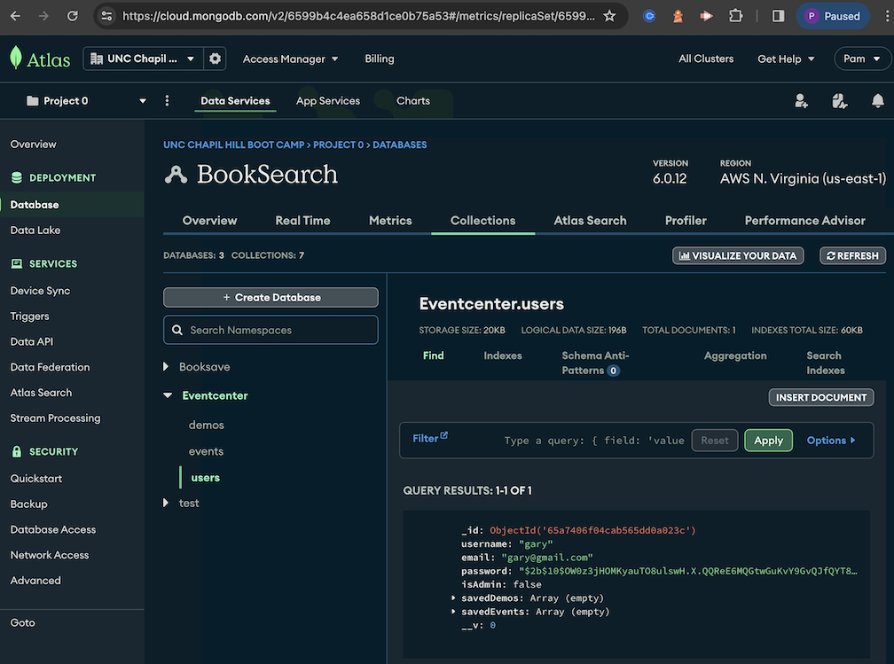
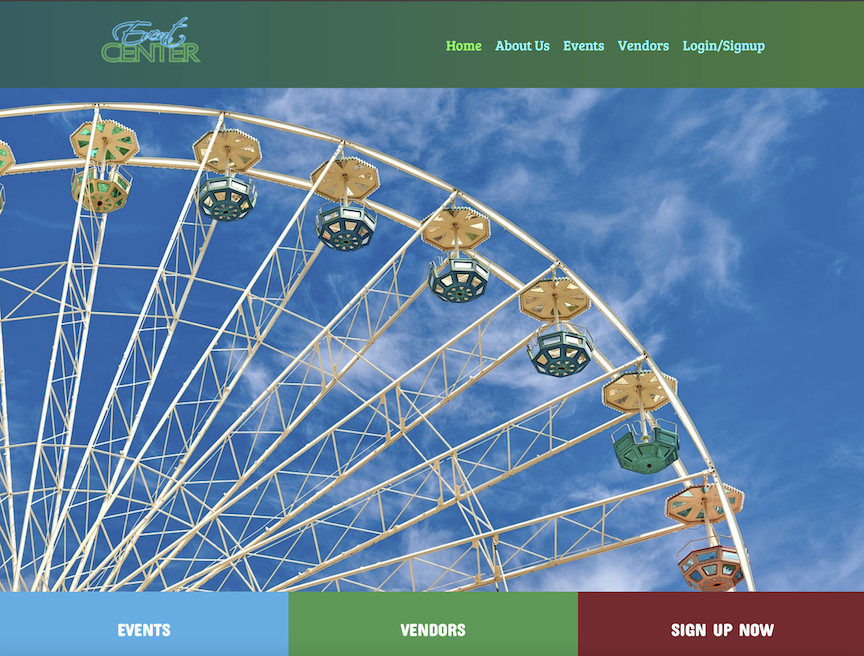
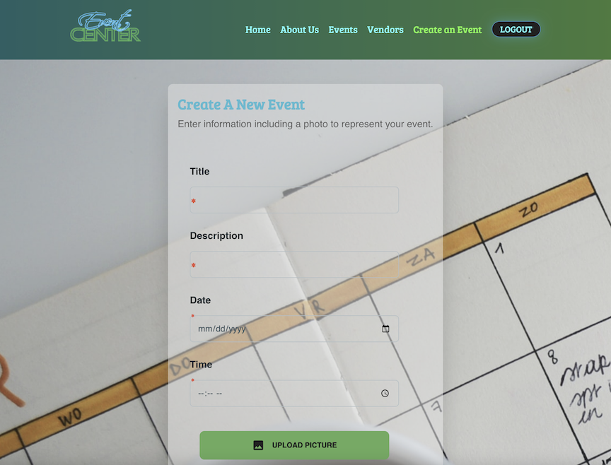
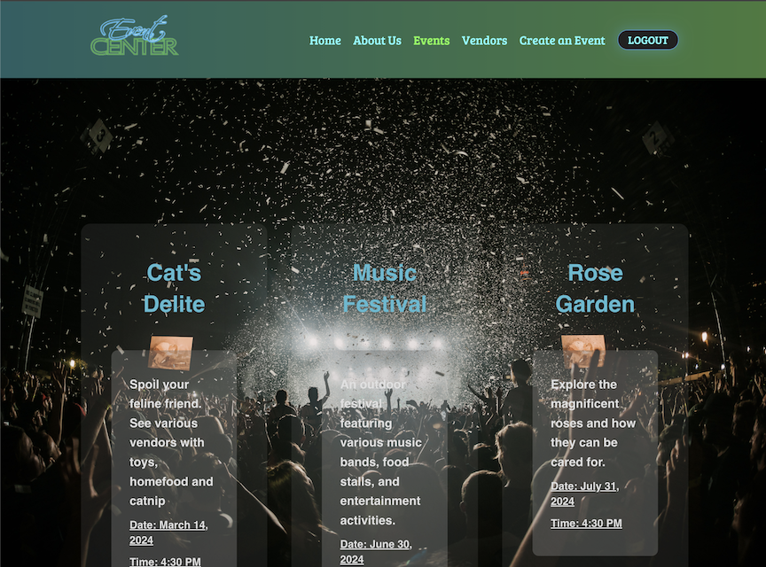

# Event Center
  

  ## Description
  
  This Event Center is a place for people to come together and find events. To see what vendors are attending and view vendors individualy in order to attend.  
      - This interactive MERN Stack application was created to highlight the use of react components and the ease of how it can hide and show components to easily map through the pages.  
    - The challenge inspired more study within react, design and layout. Looking into React it was interesting to find all that it could do and how javascript breaks down exactly what will show.  
    - React creates the ability to keep the header and footer the same while changing out the body for each page. This saves on coding and therefore speeds up the site.  
    - Material-Tailwinds, CSS and HTML are treated differently in React and are better organized to be particular for each page. This project also gave a better understanding of the supporting javascript needed to change out the particular items.   
     - The use of graphql was implemented using Models and Schemas: including typeDefs & Resolvers. Mutations and Queeries were created within the Schemas and then used on the client side.  
    - Vite tool was installed as a developer tool to see immediate changes as they were happening.  
  
  ## Table of Contents
  
  * [Usage](#usage)
  
* [License](#license)

 * [Contribution](#contribution)
  
  * [Contact Information](#Contact-Information)
  
  
  ## Usage 
  
  The Event Center is to be used by vendors of all kinds in order to create events and register with the site in order to promote their goods and services.  
  Here is the link to view our App:
  [Click here](https://eventcenter.onrender.com/)  
  Below demonstrates it is linked to MongoDb Atlas and can receive data:  
    
  Below shows some of the pictures from developer view:  
    
    
    
  

  ## Installation 
  
  This project can be downloaded from github, be sure to create a .env file for secrets and time. Run npm i to get started and then run "npm run dev" to run the vite tool. Vite is a frontend tool that is used for building fast and optimized web applications. It uses a modern build system and a fast development server to provide a streamlined and efficient development experience. Below are screenshots from the development view.  
    
    
  
  ## License
        This project is licensed under the MIT license.
  
  ## Contribution 
  
  We're always welcome to proposed improvements, if you see something and wish to help us fix, create a pull request!

  This was created with the assistance of our TA Carl Vega, and many of our tutors.
  
  
  ## Contact Information
  
  ### Pam Willis

  pwillisop@yahoo.com
  
  https://github.com/PamWillis
  
  ### Alan Mecca
  Amecca1968@gmail.com
  
  https://github.com/ajmecca68

  ### Josiah Smith
  josiahsmith1359@gmail.com
  
  https://github.com/jssmith73

  ### David Honeycutt
  darvidian123456@gmail.com
  
  https://github.com/thefrenchman1

  ### Chris Ahn
  christaehyunahn@gmail.com
  
  https://github.com/chrisahn10

  ### David Mora
  david2631@gmail.com
  
  https://github.com/Prosentint
  
